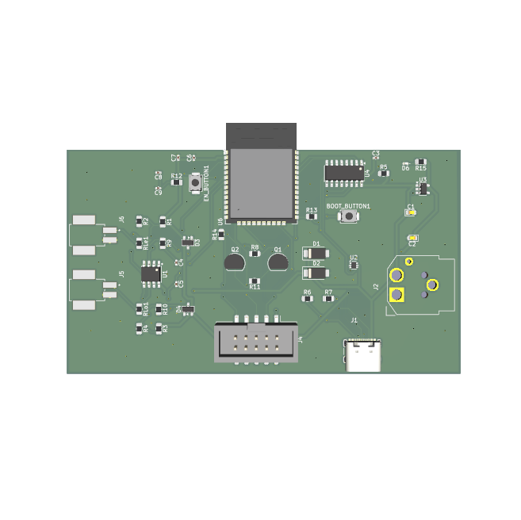

# current_monitoring_esp32

Modular firmware project in PlatformIO and hardware design in KiCad using ESP32 and ESP-IDF framework for measuring current and detecting leakage using CT sensors, publishing the data via MQTT through Wifi ( and Ethernet, but not yet fully implemented ). For more informatation on design decisions consult the `docs` directory.



## Project structure

```
.
├── .github/workflows/          # CI/CD
├── app/                        # Two alternatives to consume the library
│   ├── bare_metal/             # Simple Super-Loop implementation
│   └── rtos/                   # RTOS Task-based
├── components/                 # Library ESP-IDF style components
│   └── current_monitor/        # RMS, Differential math, Calibration
│   └── network_manager/        # Wifi, Ethernet and MQTT
├── docs/                       # Documentation
├── kicad/                      # KiCad files
│   └── current_monitor_board/  # KiCad project
│   └── mods/                   # KiCad libraries
├── scripts/                    # Scripts for the project
├── test/                       # Unit tests for the monitor library
├── platformio.ini              # Multi-environment config
├── wokwi.toml                  # Simulation config for ESP32 + Sensors
└── diagram.json                # Wokwi hardware layout
```

## Installation

### With Docker

Requirements:

- Docker
- Docker Compose
- just (Optional)

using just:

```bash
just dev init
```

without just

```bash
DOCKER_COMPOSE_SERVICE=current_monitoring_esp32-app

docker-compose run --rm $DOCKER_COMPOSE_SERVICE just init
```

### Without Docker:

Requirements:

- uv (Python manager)
- PlatformIO CLI
- Wokwi (Optional, needed for simulation)
- just (Optional)

using just:

```bash
just init
```

without just

```bash
uv sync
uv run pio run -t compiledb
```

### Git hooks

using uv and just

```bash
just pre-commit-init
```

using only uv

```bash
uv run pre-commit install --hook-type pre-commit --hook-type pre-push
```

and it can also be installed using only Python.

## Build

### With Docker

using just:

```bash
just dev build
```

without just

```bash
DOCKER_COMPOSE_SERVICE=current_monitoring_esp32-app

docker-compose run --rm $DOCKER_COMPOSE_SERVICE just init
```

### Without Docker:

using just:

```bash
just build
```

without just

```bash
uv run pio run -e bare_metal -e rtos
```

## Flash

...

## TODO

### current_monitor:

- [ ] Acquisition interval missed
- [ ] Convert raw into voltage
- [ ] Calibration

### mqtt:

### App:

### Flash

- [ ] Add flash scripts
- [ ] efuse
- [ ] self-contained flash script

### Docs:

- [ ] Hardware mapping
- [ ] C4 model

### KiCad

- [ ] MQTT thru Ethernet

### Other:

- [x] Test with PlatformIO IDE
- [ ] Run Tests without `static inline` functions
