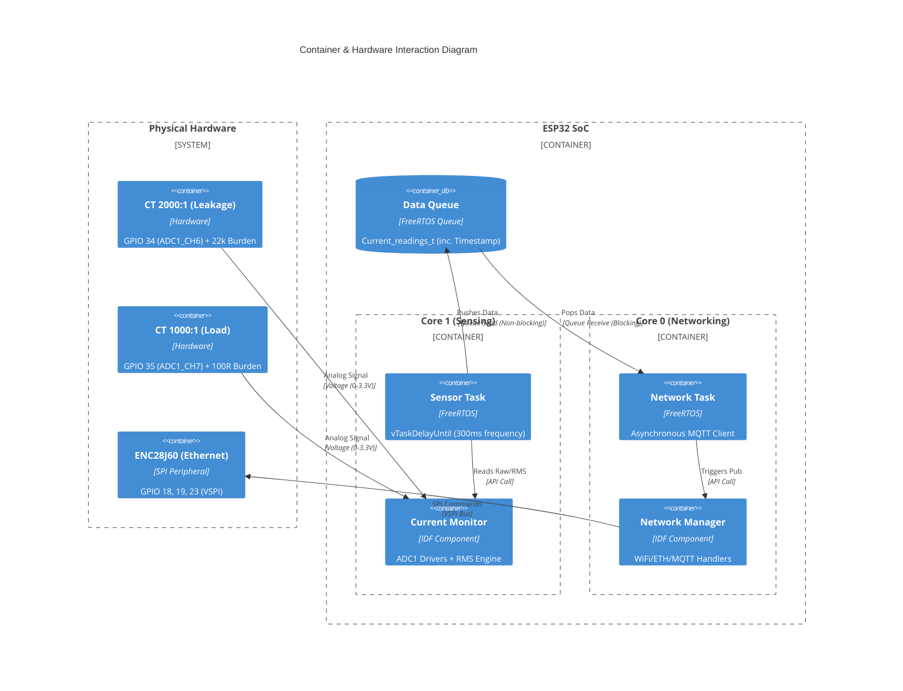

## Design Documentation

## 1. System Architecture

## 3. Design Decisions

### 3.1 RMS Sampling Strategy

To meet the 300ms maximum interval requirement, the firmware implements a high-frequency sampling window:

- Sampling Frequency: ~5-10kHz per channel to accurately capture 60Hz waveforms.
- RMS Calculation: Discrete-time True RMS calculation is performed: $V_{rms} = \sqrt{\frac{1}{N} \sum_{i=1}^{N} (v_i - V_{offset})^2}$
- Fixed Frequency: Using `vTaskDelayUntil` ensures the 300ms deadline is strictly met regardless of calculation overhead, avoiding drift.

### 3.2 Noise Handling

- Hardware Offset: A 1.65V DC bias is applied to the CT signal to allow the ESP32 (0-3.3V range) to sample the AC negative half-cycle.
- Software Filtering:
  - Deadzone: A small software threshold is applied to eliminate "ghost" readings caused by ADC noise floor.
  - Averaging: Multiple samples are accumulated per window to smooth out transient spikes.
  - Hardware Calibration: ADC calibration to mitigate chip-to-chip gain errors.

### 3.3 Software Architecture

- Modular Component Architecture: Logic is segregated into reusable, standalone components (`current_monitor`, `network_manager`) to minimize coupling and facilitate parallel testing.
- Provider/Consumer Model: The `apps/` act as consumers of the `components/` provider library. This allows the same hardware-interfacing code to be reused across different execution models (Bare-Metal Super-Loop vs. RTOS Preemptive Tasks).
- Opaque Handle Pattern: By using pointer-based handles for component initialization and interaction, the internal structures remain protected from the application layer, reducing the risk of accidental memory corruption.
- Decoupling (Dual-Core): Sampling is pinned to Core 1 to ensure zero jitter.
- Networking (WiFi/MQTT) is pinned to Core 0 to handle the non-deterministic TCP/IP stack.
- Unified Identity: Both Wi-Fi and Ethernet use the internal Factory MAC as the MQTT Client ID, ensuring the backend treats the device as a single entity regardless of the physical connection.
